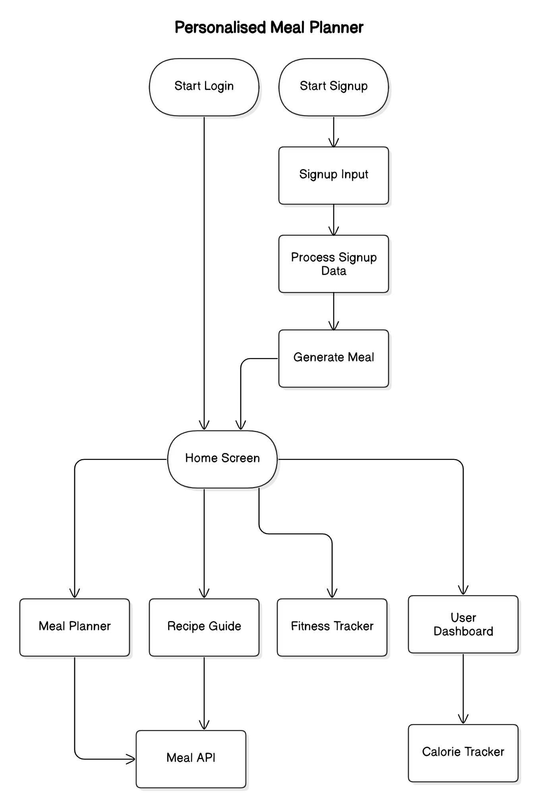
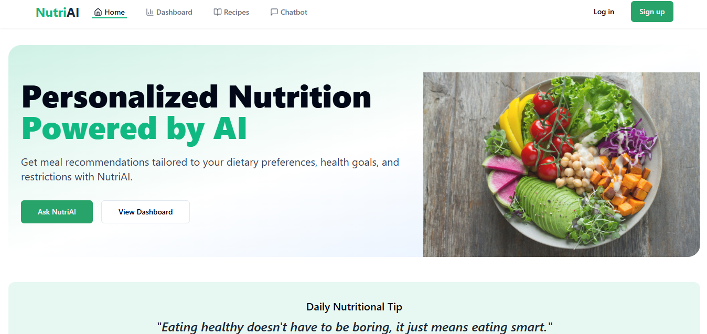

NutriAI is a smart, user-friendly web application that offers personalized meal planning, recipe suggestions, and fitness tracking tailored to individual dietary needs, preferences, and health goals. Powered by API integration and Firebase storage, it generates 7-day meal plans based on user-selected goals (weight gain, loss, maintenance), diet type (vegetarian, vegan, paleo), and allergy inputs.

🌟 Key Features:
🧠 Personalized Meal Planning – Dynamic plans based on user input and nutritional needs.

📖 Recipe Guide – Detailed recipes with ingredients, instructions, and smart substitutions.

🏋️ Fitness Tracker – Track workouts and health metrics to complement your diet.

🔄 Calorie & Progress Tracker – Visual dashboards to monitor weekly progress and adjust plans.

💬 Conversational Chatbot Interface – Interactive chatbot for goal setting and feedback collection.

**Architecture**

**Home Page**

